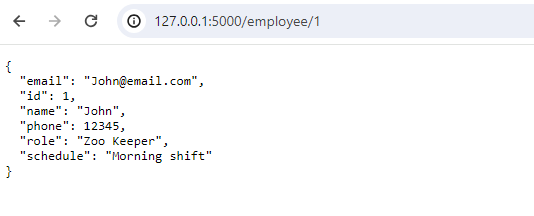

# API Development with Flask and Supabase   

Flask API for managing a zoo.  
This API will allow zookeeper to efficiently manage various aspects of the zoo, such as animal information, enclosures, feeding schedules, and more

## Component  

### Animal Management   

Add, update, or delete information about animals in the zoo.  

#### Details  

- Id  
- Name
- Species 
- Binomial name
- Age
- Gender
- Food
- Diet category
- Animal class 

#### API Endpoints  
- **GET /animals:** Retrieve a list of all employees in the zoo  
- **GET /animals/<id>:** Retrieve a specific employee by their id
- **POST /animals:** Add a new employee to the zoo. 
- **PUT /animals/<id>:** Update an existing employee by their id
- **DELETE /animals/<id>:** Delete an existing employee by their id

### Employee Management    
Add, update, or delete information about employee  

#### Details
- Id
- Name
- Email
- Phone
- Schedule 

#### API Endpoints
- **GET /employees:** Retrieve a list of all employees in the zoo
- **GET /employees/<id>:** Retrieve a specific employee by their id
- **POST /employees:** Add a new employee to the zoo. 
- **PUT /employees/<id>:** Update an existing employee by their id
- **DELETE /employees/<id>:** Delete an existing employee by their id 


## Library and dependencies  

- Python
- PIP
- Poetry
- Flask
- SQL Alchemy
- [Supabase](https://supabase.com/)
- Postman 


## Run on local environment  


```bash
poetry run flask --app .\app\ run

```

Open [http://127.0.0.1:5000/employee/](http://127.0.0.1:5000/employee/) with your browser to see the result.

Links
http://127.0.0.1:5000/employee/
http://127.0.0.1:5000/animal/

http://127.0.0.1:5000/employee/<id>  
Example:
http://127.0.0.1:5000/employee/1

http://127.0.0.1:5000/animal/<id>  
Example:
http://127.0.0.1:5000/animal/2

  
  

## Run on local environment  

```bash
poetry run pytest --cov=app

```